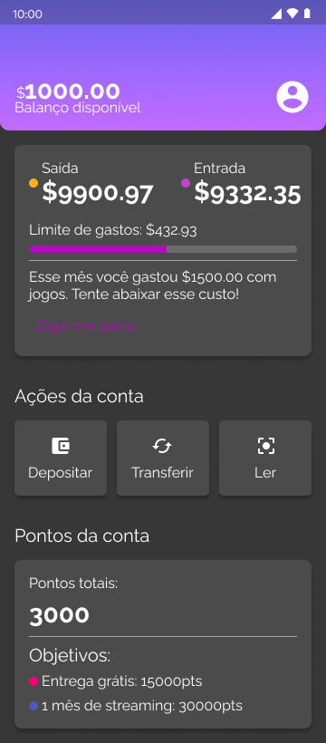
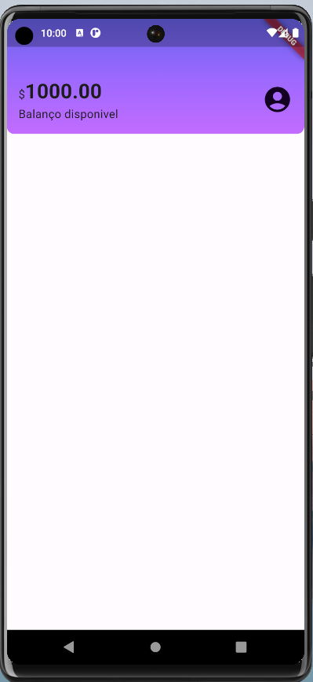
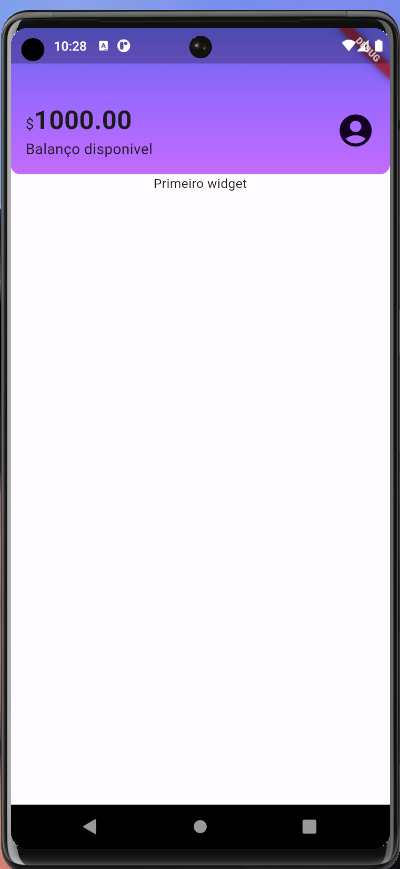
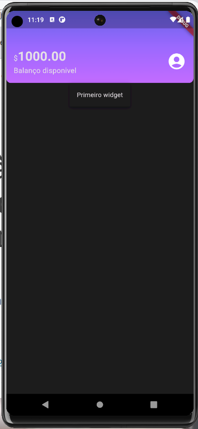
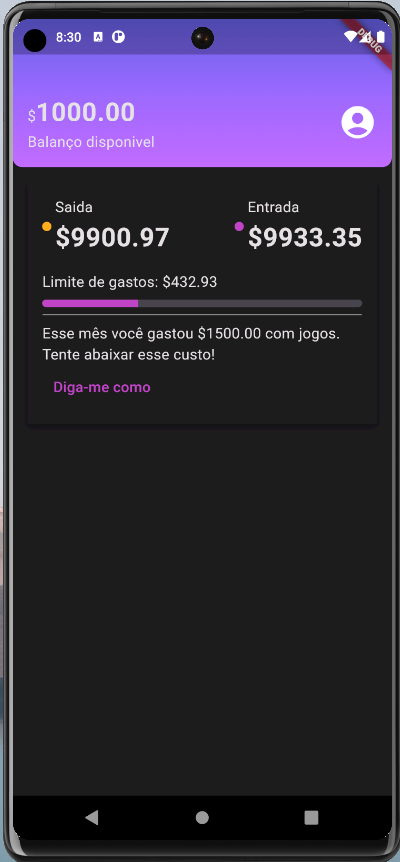
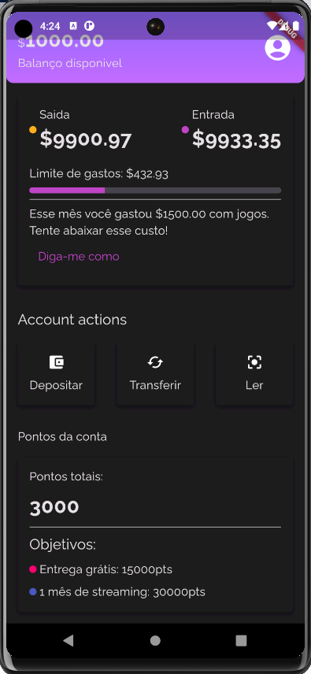

# Aprendendo como fazer layouts com Flutter apartir do figma  

Este projeto é fruto do curso de 'Flutter : Estilizando e reproduzindo layouts' da plataforma ALURA

Tratasse de um exercício onde o objetivo é trazer um layout definido no figma para nosso recem criado app flutter chamado de Alubank
 
  
  
 

## O desenvolvimento

    E realizada uma analise onde o layout é divido em blocos que serão nossos futuros widgets e 
       serão apresentados widgets nativos do dart assim como do material que estarão compondo nosso app   

## Objetivos do exercicio

 
  - Como ler um layout no Figma e planejar como será a sua estrutura em código;
  - O processo de priorização de conteúdo antes de estilização;
  - O que são Widgets de conteúdo;
  - Widgets Flutter e Widgets Material.
  - Aplicar os Widgets de estilização como TextStyle e BoxDecoration para mostrar textos e decorar o Header (cabeçalho do app);
  - Lidar com Widgets de organização como Row, Column e Padding para delimitar os espaçamentos e alinhamentos de Widgets exibidos na tela;
  - Identificar as diferenças entre os Widgets Text e Text.rich para exibir textos e parágrafos, bem como utilizá-los;
  - Implementar um gradiente de cores dentro do Header
  - Perceber repetições visuais e estruturais no projeto, aplicando técnicas para organizar o código conforme o layout;
  - Planejar a estrutura de um Widget customizado para se adequar às necessidades do projeto;
  - Receber Widgets dentro de outros Widgets, pensando em deixar nosso widget customizado mais flexível possível;
  - Conhecer a propriedade de sombreamento de Widgets para adicionar um novo efeito visual.
  - Compreender o que são temas e para que servem;
  - Ver padrões para a criação de um tema customizado;
  - Estabelecer as cores que serão utilizadas no projeto em um arquivo isolado;
  - Desenvolver um novo tema com nossas cores e propriedades tipográficas;
  - Adaptar o nosso projeto para utilizar as estilizações do nosso novo tema.
  - Diferenciar elementos visuais de elementos com conteúdo;
  - Entender as necessidades de criar Widgets específicos para esses elementos visuais;
  - Aplicar Widgets estilizados na prática: esferas pequenas coloridas, linha para separar seções do conteúdo;
  - Praticar o conceito de utilizar todos os recursos que preparamos até o momento para finalizar a seção de RecentActivity. 
  - Criar interações de toque do usuário com o Widget InkWell;
  - Implementação de famílias de fonte diferentes em nosso projeto.

  ## Duração

    - 10hs

  ## Evolução 

    # Criação do header

    - Aplicar os Widgets de estilização como TextStyle e BoxDecoration para mostrar textos e decorar o Header (cabeçalho do app);
    - Lidar com Widgets de organização como Row, Column e Padding para delimitar os espaçamentos e alinhamentos de Widgets exibidos na tela;
    - Identificar as diferenças entre os Widgets Text e Text.rich para exibir textos e parágrafos, bem como utilizá-los;
    - Implementar um gradiente de cores dentro do Header
  
  
   

   - Continuando o layout, criando compomentes 
   - Perceber repetições visuais e estruturais no projeto, aplicando técnicas para organizar o código conforme o layout;
   - Planejar a estrutura de um Widget customizado para se adequar às necessidades do projeto;
   - Receber Widgets dentro de outros Widgets, pensando em deixar nosso widget customizado mais flexível possível;
   - Conhecer a propriedade de sombreamento de Widgets para adicionar um novo efeito visual.
   - Definição de tema para aplicação
   - Personalizando tema da aplicação
   - Refatorando cores para um unico arquivo
   - Transposição do gradiente de cores para o arquivo centralizado
   - Definindo tamanho de fontes centralizadas em my_theme.dart 
   -  Aplicar Widgets estilizados na prática: esferas pequenas coloridas, linha para separar seções do conteúdo;
  
 

  
  
  
   

 
### Estudo de temas

  - Compreender o que são temas e para que servem;
  - Ver padrões para a criação de um tema customizado;
  - Estabelecer as cores que serão utilizadas no projeto em um arquivo isolado;
  - Desenvolver um novo tema com nossas cores e propriedades tipográficas;
  - Adaptar o nosso projeto para utilizar as estilizações do nosso novo tema.

### Construção do widget cartão

  - Criação dos widgets que serão utilizados dentro dos cartões. Criando o widget 'ColorDot' 
    obs: necessário indicar o parametro color como sendo opcional (?) devido ao flutter não reconhecer o map de cores em 'recentActivity'

  - Criação dos widgets que serão utilizados dentro do cartões. Criando o widget 'ContentDivision' 
 
 

  
  
 

### Estilizações finais : ações e tipografia

   - implementando 'accountActions', utilizando InkWell (adição de evento),padronizando nova tipografia 'Raleway'
 
   
    
    
    

### conclusão do projeto
 - Aconteceu um erro de over flow que foi contornado com o uso de um widget 'SingleChildScrollView' válido para objetos estáticos como é o caso do exercicio

 

  
  
  
 

    
